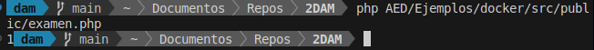

# Introducción-a-Php-uso-de-funciones

## Número capicúa (palíndromo numérico)

Implementa una función __esCapicua(int $n): bool__ que determine si un número entero positivo es capicúa.

- Un número es capicúa si se lee igual de izquierda a derecha que de derecha a izquierda.

> Ejemplo: `12321` → `true`

```php
<?php 
    declare(strict_types=1);
    function esCapicua(int $n): bool {
        if ($n < 0) {
            return false;
        }
        String $s = (string) $n;
        return $s === strrev($s);
    }
    echo esCapicua(12321);
?>
```



## Escalera de asteriscos

Implementa una función __montañaAsteriscos(int $n, $m): void__ que imprima una escalera de asteriscos de altura `N`y el tamaño M.

- La primera fila contiene 1 asterisco, la segunda 2, y así hasta `N`, `M` veces.

> Ejemplo con entrada `4,2`:

```text
*.     *
**.   **
***  ***
********
```

```php
<?php
    // SIN TERMINAR
    declare( strict_type=1);
    function montañaAsteriscos(int $n, int $m) {
        for ($i = 1; $i <= $n; $i++) {
        echo str_repeat("*", $i);
        echo "<br>";
        }
    }
    echo montañaAsteriscos(4,2);
?>
```

## Suma de dígitos

Implementa una función __sumaDigitos(int $n): int__ que calcule la suma de los dígitos de un número entero positivo.

- Descompón el número en dígitos y súmalos.

> Ejemplo: `2025` → `9` (2+0+2+5)

```php
<?php
function sumaDigitos(int $n): int {
    if ($n < 0) {
        return $n;
    }
    $s = (string) $n;
    $suma = 0;
    for ($i = 0; $i < strlen($s); $i++) {
        $suma += (int) $s[$i];
    }
    return $suma;
}
echo sumaDigitos(15);
?>
```

## Número secreto (múltiplos de 3 o 5)

Implementa una función __multiplosTresOCinco(int $n): array__ que devuelva todos los múltiplos de 3 o 5 menores que `N`.

- Además, calcula la suma de dichos múltiplos.

> Ejemplo con entrada `10`:

```code
3, 5, 6, 9
Suma = 23
```

```php
<?php
function multiplosTresOCinco(int $n): array {
    if ($n <= 0) {
        return null;
    }
    $resultado = [];
    for ($i = 1; $i < $n; $i++) {
        if ($i % 3 === 0 || $i % 5 === 0) {
            array_push($resultado,$i);
        }
    }

    return $resultado;
}
foreach (multiplosTresOCinco(10) as $n) {
    echo $n . " ";
}
?>
```

## Secuencia de Collatz

Implementa una función __secuenciaCollatz(int $n): array__ que genere la secuencia de Collatz a partir de un entero positivo.

- Si el número es par → dividir entre 2.  
- Si es impar → multiplicar por 3 y sumar 1.  
- Repetir hasta llegar a 1.

> Ejemplo con entrada `6`:

```code
6 → 3 → 10 → 5 → 16 → 8 → 4 → 2 → 1
```

```php
<?php
    declare( strict_type=1);
    function secuenciaCollatz(int $n): array {
    $secuencia = [];
	array_push($secuencia,$n);
    while ($n !== 1) {
        if ($n % 2 === 0) {
            $n = intdiv($n, 2);
        } else {
            $n = 3 * $n + 1;
        }
        array_push($secuencia,$n);
    }
    return $secuencia;
}
    foreach (secuenciaCollatz(6) as $n) {
    echo $n . " ";
}
?>
```

---